<div align="center">

# 🌈🚀 Shorty URL
### <i>Production-Ready Full-Stack URL Shortener with Clean Architecture</i>

<p>
  
  
  
  
  
</p>

<p>
  <b>🔗 Smart URL Shortening</b> &nbsp;•&nbsp;
  <b>🔐 Secure Authentication</b> &nbsp;•&nbsp;
  <b>📊 Click Analytics</b> &nbsp;•&nbsp;
  <b>☁️ Deploy on Render + Vercel</b>
</p>

<br/>

<table>
  <tr>
    <td align="center"><b>⚡ Fast UX</b><br/>Quickly shorten and copy links.</td>
    <td align="center"><b>🛡️ Secure</b><br/>Helmet + Rate Limit + Cookie auth.</td>
    <td align="center"><b>🧱 Scalable Design</b><br/>Controller → Service → DAO layering.</td>
  </tr>
</table>

</div>

---

## 📚 Table of Contents

1. [🎯 Project Vision](#-project-vision)
2. [✨ Key Highlights](#-key-highlights)
3. [🧭 System Architecture](#-system-architecture)
4. [🖼️ Diagram Gallery](#diagram-gallery)
5. [📂 Repository Structure](#-repository-structure)
6. [🔧 Backend Deep Dive](#-backend-deep-dive)
   - [Entry & Global Middleware](#entry--global-middleware)
   - [Config Layer](#config-layer)
   - [Models Layer](#models-layer)
   - [DAO Layer](#dao-layer)
   - [Services Layer](#services-layer)
   - [Controllers Layer](#controllers-layer)
   - [Routes Layer](#routes-layer)
   - [Utilities Layer](#utilities-layer)
   - [Middleware Layer](#middleware-layer)
7. [🎨 Frontend Deep Dive](#-frontend-deep-dive)
   - [Bootstrapping & Providers](#bootstrapping--providers)
   - [Routing System](#routing-system)
   - [State Management](#state-management)
   - [API Client Layer](#api-client-layer)
   - [Components](#components)
   - [Pages](#pages)
   - [Frontend Utilities](#frontend-utilities)


8. [🧠 Backend & Frontend Sequence Flows](#-backend--frontend-sequence-flows)
9. [🔐 Environment Variables](#-environment-variables)
10. [📡 API Endpoints](#-api-endpoints)
11. [▶️ Run Locally](#-run-locally)
12. [☁️ Deployment Guide](#-deployment-guide)
13. [🧪 Troubleshooting](#-troubleshooting)
14. [🚀 Future Improvements](#-future-improvements)
15. [🤝 Contribution](#-contribution)

---

## 🎯 Project Vision

> Shorty URL is designed as a real-world URL shortener, not just a demo project.

It balances **developer experience**, **application security**, and **production-readiness**:

- ✅ **Simple for users** — create, copy, and manage short links quickly.
- ✅ **Secure by default** — JWT cookie auth, CORS control, Helmet, and rate limiting.
- ✅ **Cleanly organized codebase** — follows `Controller → Service → DAO` architecture.
- ✅ **Deployment friendly** — environment-driven setup with health checks.


## ✨ Key Highlights

<table>
  <tr>
    <th>Feature</th>
    <th>Why it matters</th>
  </tr>
  <tr>
    <td>🔗 Guest + Auth URL Creation</td>
    <td>Visitors can shorten links instantly; logged-in users get persistent history.</td>
  </tr>
  <tr>
    <td>🏷️ Custom Slugs</td>
    <td>User-defined slugs are normalized and collision-checked before saving.</td>
  </tr>
  <tr>
    <td>📈 Click Tracking</td>
    <td>Redirect flow increments click count, enabling lightweight analytics.</td>
  </tr>
  <tr>
    <td>🛠️ Operational Health Endpoint</td>
    <td><code>/api/health</code> simplifies deployment validation and uptime checks.</td>
  </tr>
  <tr>
    <td>🏗️ Layered Architecture</td>
    <td>Business logic separation makes the code easier to maintain and test.</td>
  </tr>
</table>

---

## 🧭 System Architecture

### High-Level System Diagram

```mermaid
flowchart LR
    UI["🎨 Frontend (React + Vite)"] -->|"Axios + Cookies"| API["⚙️ Backend API (Express)"]
    API --> AUTH["🔐 Auth Routes"]
    API --> CREATE["🔗 Create URL Route"]
    API --> HISTORY["📚 User History Route"]
    API --> REDIRECT["↪️ Redirect /:id"]
    API <--> DB[("🍃 MongoDB")]

    classDef frontend fill:#E0F2FE,stroke:#0284C7,color:#0C4A6E;
    classDef backend fill:#DCFCE7,stroke:#16A34A,color:#14532D;
    classDef route fill:#FEF3C7,stroke:#D97706,color:#7C2D12;
    classDef database fill:#F3E8FF,stroke:#9333EA,color:#581C87;

    class UI frontend;
    class API backend;
    class AUTH,CREATE,HISTORY,REDIRECT route;
    class DB database;
```



### Internal Backend Request Flow


### One-Line Flow Summary

```text
UI Action → API Route → Controller → Service → DAO → MongoDB → Response

```

---


<a id="diagram-gallery"></a>

## 🖼️ Diagram Gallery

### 🔐 Authentication Lifecycle


### 🔗 URL Creation Flow


### 📊 Redirect + Analytics Flow


---

## 📂 Repository Structure

```text
Shorty_url/
├── BACKEND/
│   ├── app.js
│   ├── package.json
│   └── src/
│       ├── config/
│       ├── controller/
│       ├── dao/
│       ├── middleware/
│       ├── models/
│       ├── routes/
│       ├── services/
│       └── utils/
├── FRONTEND/
│   ├── package.json
│   ├── vite.config.js
│   └── src/
│       ├── api/
│       ├── components/
│       ├── pages/
│       ├── routing/
│       ├── store/
│       └── utils/
└── README.md
```

---

## 🔧 Backend Deep Dive

<div align="center">


### 🛠️ Backend at a Glance

<table>
  <tr>
    <td align="center"><b>🧠 Architecture</b><br/>Controller → Service → DAO</td>
    <td align="center"><b>🔒 Security</b><br/>Helmet + Rate Limit + Cookie Auth</td>
    <td align="center"><b>⚡ Reliability</b><br/>Health Checks + Global Error Handler</td>
  </tr>
</table>

</div>

### Backend Layer Diagram


### Entry & Global Middleware

**File:** `BACKEND/app.js`

Responsibilities:
- initializes Express + dotenv configuration
- starts MongoDB connection bootstrap
- enables `trust proxy` for hosted environments
- adds security middleware: `helmet`, `express-rate-limit`
- configures dynamic CORS from `CORS_ORIGIN`
- parses JSON, URL-encoded payloads, and cookies
- attaches user from auth token if available
- mounts all route groups
- exposes health endpoint and redirect endpoint
- uses centralized error handling middleware

### Backend File Map (Beautiful View)

| Layer | Files | What this layer does |
|---|---|---|
| ⚙️ Config | `src/config/config.js`, `src/config/monogo.config.js` | Keeps cookie/runtime settings and DB bootstrap centralized. |
| 🗃️ Models | `src/models/user.model.js`, `src/models/short_url.model.js` | Defines schema rules for users and shortened URLs. |
| 🧱 DAO | `src/dao/user.dao.js`, `src/dao/short_url.js` | Isolates DB access and query logic from business logic. |
| 🧠 Services | `src/services/auth.service.js`, `src/services/short_url.service.js` | Applies validation, normalization, collision checks, auth logic. |
| 🎛️ Controllers | `src/controller/auth.controller.js`, `src/controller/short_url.controller.js`, `src/controller/user.controller.js` | Converts HTTP requests into service calls and response payloads. |
| 🛣️ Routes | `src/routes/auth.routes.js`, `src/routes/short_url.route.js`, `src/routes/user.routes.js` | Defines API endpoints and connects them to controllers. |
| 🧰 Utilities | `src/utils/helper.js`, `src/utils/attachUser.js`, `src/utils/errorHandler.js`, `src/utils/tryCatchWrapper.js` | Shared helpers for JWT, user attach flow, error handling and async safety. |
| 🛡️ Middleware | `src/middleware/auth.middleware.js` | Protects private endpoints and enforces login checks. |


### Routes Layer

| File | Endpoints |
|---|---|
| `src/routes/auth.routes.js` | `/register`, `/login`, `/logout`, `/me` |
| `src/routes/short_url.route.js` | `/` (mounted at `/api/create`) |
| `src/routes/user.routes.js` | `/urls` (mounted at `/api/user`) |


---

## 🎨 Frontend Deep Dive

<div align="center">

### ✨ Frontend at a Glance

<table>
  <tr>
    <td align="center"><b>🧭 Routing</b><br/>TanStack Router-based pages</td>
    <td align="center"><b>🧰 State</b><br/>Redux Toolkit + React Query</td>
    <td align="center"><b>🔗 API</b><br/>Axios client with credentials</td>
  </tr>
</table>

</div>

### Frontend Interaction Diagram


### Bootstrapping & Providers

**File:** `FRONTEND/src/main.jsx`

- creates React Query client
- mounts Redux store provider
- mounts TanStack Router provider

### Frontend File Map (Beautiful View)

| Layer | Files | Responsibility |
|---|---|---|
| 🧭 Routing | `src/routing/routeTree.js`, `src/routing/homepage.js`, `src/routing/auth.route.js`, `src/routing/dashboard.js`, `src/routing/history.js` | Declares route tree and page navigation behavior. |
| 🧠 State | `src/store/store.js`, `src/store/slice/authSlice.js` | Handles auth state and global app store concerns. |
| 🌐 API | `src/api/user.api.js`, `src/api/shortUrl.api.js`, `src/utils/axiosInstance.js` | Encapsulates server communication with credentials and normalized errors. |
| 🧩 Components | `src/components/NavBar.jsx`, `src/components/LoginForm.jsx`, `src/components/RegisterForm.jsx`, `src/components/UrlForm.jsx`, `src/components/UserUrl.jsx` | Reusable UI units for auth, URL creation, and history rendering. |
| 📄 Pages | `src/pages/HomePage.jsx`, `src/pages/AuthPage.jsx`, `src/pages/DashboardPage.jsx`, `src/pages/HistoryPage.jsx` | Page-level composition for complete user flows. |
| 🎨 Utilities/Layout | `src/RootLayout.jsx`, `src/utils/helper.js`, `src/index.css` | Shared layout shell, auth guard helpers, and global styling. |

### Components Snapshot

| Component | UI Purpose |
|---|---|
| `NavBar` | Top navigation and auth-aware actions |
| `LoginForm` / `RegisterForm` | User authentication forms |
| `UrlForm` | Long URL + optional custom slug input + copy short URL |
| `UserUrl` | Authenticated user history and click metrics |


---

## 🧠 Backend & Frontend Sequence Flows

### Backend Sequence — URL Creation


### Backend Sequence — Redirect + Click Analytics


### Frontend Sequence — URL Creation Interaction


---

## 🔐 Environment Variables

### Backend (`BACKEND/.env`)

```env
PORT=5000
MONGO_URI=<mongo_connection_string>
# optional fallback
MONGODB_URI=<mongo_connection_string>

JWT_SECRET=<jwt_secret>
APP_URL=http://localhost:5000/
CORS_ORIGIN=http://localhost:5173,https://your-frontend.vercel.app
```

Optional (typically provided by Render):

```env
RENDER_EXTERNAL_URL=<render_generated_url>
```

### Frontend (`FRONTEND/.env`)

```env
VITE_API_BASE_URL=http://localhost:5000
```

---

## 📡 API Endpoints

| Method | Path | Description |
|---|---|---|
| GET | `/api/health` | service health check |
| POST | `/api/auth/register` | register a new user |
| POST | `/api/auth/login` | login user |
| GET | `/api/auth/logout` | logout current user |
| GET | `/api/auth/me` | get current authenticated user |
| POST | `/api/create` | create short URL |
| POST | `/api/user/urls` | fetch all URLs for authenticated user |
| GET | `/:id` | redirect from short code to original URL |

---

## ▶️ Run Locally

### 1) Clone repository
```bash
git clone <your-repo-url>
cd Shorty_url
```

### 2) Install backend dependencies
```bash
cd BACKEND
npm install
```

### 3) Install frontend dependencies
```bash
cd ../FRONTEND
npm install
```

### 4) Start backend server
```bash
cd ../BACKEND
npm start
```

### 5) Start frontend development server
```bash
cd ../FRONTEND
npm run dev
```

---

## ☁️ Deployment Guide

### Deployment Topology


### Render (Backend)
1. Deploy `BACKEND` as a web service.
2. Configure backend environment variables.
3. Verify `https://<your-backend-domain>/api/health` returns `status: ok`.


### Vercel (Frontend)
1. Deploy `FRONTEND` as a Vercel project.
2. Set `VITE_API_BASE_URL` to your deployed backend URL.
3. Redeploy and validate full auth + URL creation flow.

---

## 🧪 Troubleshooting

### 1) CORS error in browser
- ensure frontend domain is included in `CORS_ORIGIN`
- keep origins comma-separated and trimmed

### 2) Short link redirect gives 404
- verify short code exists in database
- verify backend redirect route `/:id` is reachable
- use lowercase short code (system generates lowercase IDs)

### 3) Login/session not persisting
- verify cookie + credentials config
- verify HTTPS and proper domains in production

### 4) Wrong base URL in generated short links
- verify `APP_URL`
- verify `RENDER_EXTERNAL_URL` behavior in deployed environment

---

## 🚀 Future Improvements

- Add automated unit/integration testing
- Add QR code generation for each short URL
- Add expiration policies for short URLs
- Add richer analytics dashboard (referrer/source/time charts)
- Add team/shared workspaces and role permissions

---

## 🤝 Contribution

1. Fork this repository
2. Create your feature branch
3. Commit your changes
4. Open a pull request

---

<div align="center">

### 💙 Built with clean architecture, secure practices, and beautiful simplicity.
If this project helps you, please consider giving it a ⭐

</div>
