<div align="center">

# 🌈🚀 Shorty URL
### <i>Production-Ready Full-Stack URL Shortener with Clean Architecture</i>

<p>
  
  
  
  
  
</p>

<p>
  <b>🔗 Smart URL Shortening</b> &nbsp;•&nbsp;
  <b>🔐 Secure Authentication</b> &nbsp;•&nbsp;
  <b>📊 Click Analytics</b> &nbsp;•&nbsp;
  <b>☁️ Deploy on Render + Vercel</b>
</p>

<br/>

<table>
  <tr>
    <td align="center"><b>⚡ Fast UX</b><br/>Quickly shorten and copy links.</td>
    <td align="center"><b>🛡️ Secure</b><br/>Helmet + Rate Limit + Cookie auth.</td>
    <td align="center"><b>🧱 Scalable Design</b><br/>Controller → Service → DAO layering.</td>
  </tr>
</table>

</div>

---

## 📚 Table of Contents

1. [🎯 Project Vision](#-project-vision)
2. [✨ Key Highlights](#-key-highlights)
3. [🧭 System Architecture](#-system-architecture)
4. [📂 Repository Structure](#-repository-structure)
5. [🔧 Backend Deep Dive](#-backend-deep-dive)
   - [Entry & Global Middleware](#entry--global-middleware)
   - [Config Layer](#config-layer)
   - [Models Layer](#models-layer)
   - [DAO Layer](#dao-layer)
   - [Services Layer](#services-layer)
   - [Controllers Layer](#controllers-layer)
   - [Routes Layer](#routes-layer)
   - [Utilities Layer](#utilities-layer)
   - [Middleware Layer](#middleware-layer)
6. [🎨 Frontend Deep Dive](#-frontend-deep-dive)
   - [Bootstrapping & Providers](#bootstrapping--providers)
   - [Routing System](#routing-system)
   - [State Management](#state-management)
   - [API Client Layer](#api-client-layer)
   - [Components](#components)
   - [Pages](#pages)
   - [Frontend Utilities](#frontend-utilities)
7. [🧠 Function-by-Function Reference](#-function-by-function-reference)
8. [🔐 Environment Variables](#-environment-variables)
9. [📡 API Endpoints](#-api-endpoints)
10. [▶️ Run Locally](#-run-locally)
11. [☁️ Deployment Guide](#-deployment-guide)
12. [🧪 Troubleshooting](#-troubleshooting)
13. [🚀 Future Improvements](#-future-improvements)
14. [🤝 Contribution](#-contribution)

---

## 🎯 Project Vision

> Shorty URL is designed as a real-world URL shortener, not just a demo project.

It balances **developer experience**, **application security**, and **production-readiness**:

- ✅ **Simple for users** — create, copy, and manage short links quickly.
- ✅ **Secure by default** — JWT cookie auth, CORS control, Helmet, and rate limiting.
- ✅ **Cleanly organized codebase** — follows `Controller → Service → DAO` architecture.
- ✅ **Deployment friendly** — environment-driven setup with health checks.

---

## ✨ Key Highlights

<table>
  <tr>
    <th>Feature</th>
    <th>Why it matters</th>
  </tr>
  <tr>
    <td>🔗 Guest + Auth URL Creation</td>
    <td>Visitors can shorten links instantly; logged-in users get persistent history.</td>
  </tr>
  <tr>
    <td>🏷️ Custom Slugs</td>
    <td>User-defined slugs are normalized and collision-checked before saving.</td>
  </tr>
  <tr>
    <td>📈 Click Tracking</td>
    <td>Redirect flow increments click count, enabling lightweight analytics.</td>
  </tr>
  <tr>
    <td>🛠️ Operational Health Endpoint</td>
    <td><code>/api/health</code> simplifies deployment validation and uptime checks.</td>
  </tr>
  <tr>
    <td>🏗️ Layered Architecture</td>
    <td>Business logic separation makes the code easier to maintain and test.</td>
  </tr>
</table>

---

## 🧭 System Architecture

### High-Level System Diagram

```mermaid
flowchart LR
    UI["🎨 Frontend (React + Vite)"] -->|"Axios + Cookies"| API["⚙️ Backend API (Express)"]
    API --> AUTH["🔐 Auth Routes"]
    API --> CREATE["🔗 Create URL Route"]
    API --> HISTORY["📚 User History Route"]
    API --> REDIRECT["↪️ Redirect /:id"]
    API <--> DB[("🍃 MongoDB")]

    classDef frontend fill:#E0F2FE,stroke:#0284C7,color:#0C4A6E;
    classDef backend fill:#DCFCE7,stroke:#16A34A,color:#14532D;
    classDef route fill:#FEF3C7,stroke:#D97706,color:#7C2D12;
    classDef database fill:#F3E8FF,stroke:#9333EA,color:#581C87;

    class UI frontend;
    class API backend;
    class AUTH,CREATE,HISTORY,REDIRECT route;
    class DB database;
```



### Internal Backend Request Flow


### One-Line Flow Summary

```text
UI Action → API Route → Controller → Service → DAO → MongoDB → Response
```

---

## 📂 Repository Structure

```text
Shorty_url/
├── BACKEND/
│   ├── app.js
│   ├── package.json
│   └── src/
│       ├── config/
│       ├── controller/
│       ├── dao/
│       ├── middleware/
│       ├── models/
│       ├── routes/
│       ├── services/
│       └── utils/
├── FRONTEND/
│   ├── package.json
│   ├── vite.config.js
│   └── src/
│       ├── api/
│       ├── components/
│       ├── pages/
│       ├── routing/
│       ├── store/
│       └── utils/
└── README.md
```

---

## 🔧 Backend Deep Dive

### Entry & Global Middleware

**File:** `BACKEND/app.js`

Responsibilities:
- initializes Express + dotenv configuration
- starts MongoDB connection bootstrap
- enables `trust proxy` for hosted environments
- adds security middleware: `helmet`, `express-rate-limit`
- configures dynamic CORS from `CORS_ORIGIN`
- parses JSON, URL-encoded payloads, and cookies
- attaches user from auth token if available
- mounts all route groups
- exposes health endpoint and redirect endpoint
- uses centralized error handling middleware

### Config Layer

| File | Why it exists |
|---|---|
| `src/config/config.js` | central cookie/security config values |
| `src/config/monogo.config.js` | MongoDB connection setup |

### Models Layer

| File | What it models | Key behavior |
|---|---|---|
| `src/models/user.model.js` | user account | password hashing + compare + safe JSON response |
| `src/models/short_url.model.js` | short URL record | long URL, short code, clicks, optional owner |

### DAO Layer

| File | Purpose |
|---|---|
| `src/dao/user.dao.js` | user lookup/create operations + user URL history retrieval |
| `src/dao/short_url.js` | short URL persistence, lookup, and click increment logic |

### Services Layer

| File | Business logic |
|---|---|
| `src/services/auth.service.js` | register/login validation, duplicate checks, token creation |
| `src/services/short_url.service.js` | slug generation, normalization, conflict handling, create flow |

### Controllers Layer

| File | Controller concern |
|---|---|
| `src/controller/auth.controller.js` | HTTP handling for register/login/logout/me + cookie set/clear |
| `src/controller/short_url.controller.js` | create short URL + redirect behavior |
| `src/controller/user.controller.js` | returns logged-in user's URL history |

### Routes Layer

| File | Endpoints |
|---|---|
| `src/routes/auth.routes.js` | `/register`, `/login`, `/logout`, `/me` |
| `src/routes/short_url.route.js` | `/` (mounted at `/api/create`) |
| `src/routes/user.routes.js` | `/urls` (mounted at `/api/user`) |

### Utilities Layer

| File | Utility role |
|---|---|
| `src/utils/helper.js` | nanoid generation + JWT sign/verify helpers |
| `src/utils/tryCatchWrapper.js` | async controller wrapper to forward errors |
| `src/utils/errorHandler.js` | consistent API error formatting |
| `src/utils/attachUser.js` | optional auth attachment from cookie token |

### Middleware Layer

| File | Role |
|---|---|
| `src/middleware/auth.middleware.js` | blocks unauthenticated access to protected routes |

---

## 🎨 Frontend Deep Dive

### Bootstrapping & Providers

**File:** `FRONTEND/src/main.jsx`

- creates React Query client
- mounts Redux store provider
- mounts TanStack Router provider

### Routing System

**Folder:** `FRONTEND/src/routing/`

| File | Purpose |
|---|---|
| `routeTree.js` | builds full route tree |
| `homepage.js` | home route config |
| `auth.route.js` | auth route config |
| `dashboard.js` | dashboard route config |
| `history.js` | history route config |

### State Management

| File | Purpose |
|---|---|
| `store/store.js` | Redux store configuration |
| `store/slice/authSlice.js` | auth state + reducers |

### API Client Layer

| File | Role |
|---|---|
| `utils/axiosInstance.js` | shared axios client (`credentials: true` + error normalization) |
| `api/user.api.js` | auth/user API calls |
| `api/shortUrl.api.js` | short URL creation API call |

### Components

| File | Responsibility |
|---|---|
| `components/NavBar.jsx` | navigation + auth actions |
| `components/LoginForm.jsx` | login input + submit flow |
| `components/RegisterForm.jsx` | registration input + submit flow |
| `components/UrlForm.jsx` | create URL flow + custom slug + copy behavior |
| `components/UserUrl.jsx` | user history list + click count display |

### Pages

| File | Responsibility |
|---|---|
| `pages/HomePage.jsx` | public landing page |
| `pages/AuthPage.jsx` | auth forms wrapper page |
| `pages/DashboardPage.jsx` | URL creation and management page |
| `pages/HistoryPage.jsx` | authenticated user's URL history page |

### Frontend Utilities

| File | Purpose |
|---|---|
| `RootLayout.jsx` | shared layout wrapper for routed pages |
| `utils/helper.js` | route-level auth checks + redirects |
| `index.css` | global styles |

---

## 🧠 Function-by-Function Reference

### Backend Functions

#### `src/controller/short_url.controller.js`
- **`buildPublicShortUrl(shortUrl)`**
  - builds full short URL from configured app/public base URL
  - normalizes trailing slashes before concatenation
- **`createShortUrl(req, res)`**
  - handles short URL creation request
  - supports both guest and authenticated users
- **`redirectFromShortUrl(req, res)`**
  - reads `:id`, resolves original URL, increments click count, redirects

#### `src/services/short_url.service.js`
- **`createShortUrlWithoutUser(url, slug?)`**
  - guest flow for generating short URLs
  - validates and normalizes optional custom slug
- **`createShortUrlWithUser(url, userId, slug?)`**
  - same flow with user ownership association

#### `src/services/auth.service.js`
- **`registerUser(name, email, password)`**
  - duplicate email check, user creation, token generation
- **`loginUser(email, password)`**
  - credential validation + token generation

#### `src/dao/short_url.js`
- **`saveShortUrl(shortUrl, longUrl, userId?)`**
- **`getShortUrl(shortUrl)`**
- **`getCustomShortUrl(slug)`**

#### `src/dao/user.dao.js`
- **`findUserByEmail(email)`**
- **`findUserByEmailByPassword(email)`**
- **`findUserById(id)`**
- **`createUser(name, email, password)`**
- **`getAllUserUrlsDao(id)`**

#### `src/utils/helper.js`
- **`generateNanoId(length = 7)`**
- **`signToken(payload)`**
- **`verifyToken(token)`**

#### `src/utils/attachUser.js`
- **`attachUser(req, res, next)`**
  - optionally decodes token and attaches `req.user`

#### `src/middleware/auth.middleware.js`
- **`authMiddleware(req, res, next)`**
  - strict guard for authenticated-only routes

#### `src/controller/auth.controller.js`
- **`register_user`**, **`login_user`**, **`logout_user`**, **`get_current_user`**

#### `src/controller/user.controller.js`
- **`getAllUserUrls`**

### Frontend Functions

#### `src/api/shortUrl.api.js`
- **`createShortUrl(url, slug)`**

#### `src/api/user.api.js`
- **`loginUser(password, email)`**
- **`registerUser(name, password, email)`**
- **`logoutUser()`**
- **`getCurrentUser()`**
- **`getAllUserUrls()`**

#### `src/utils/helper.js`
- **`checkAuth({ context })`**
  - React Query based auth check
  - syncs Redux state
  - redirects unauthenticated users

#### Component-local handlers
- `UrlForm.handleSubmit`
- `UrlForm.handleCopy`
- `UserUrl.handleCopy`
- submit handlers in `LoginForm` and `RegisterForm`

---

## 🔐 Environment Variables

### Backend (`BACKEND/.env`)

```env
PORT=5000
MONGO_URI=<mongo_connection_string>
# optional fallback
MONGODB_URI=<mongo_connection_string>

JWT_SECRET=<jwt_secret>
APP_URL=http://localhost:5000/
CORS_ORIGIN=http://localhost:5173,https://your-frontend.vercel.app
```

Optional (typically provided by Render):

```env
RENDER_EXTERNAL_URL=<render_generated_url>
```

### Frontend (`FRONTEND/.env`)

```env
VITE_API_BASE_URL=http://localhost:5000
```

---

## 📡 API Endpoints

| Method | Path | Description |
|---|---|---|
| GET | `/api/health` | service health check |
| POST | `/api/auth/register` | register a new user |
| POST | `/api/auth/login` | login user |
| GET | `/api/auth/logout` | logout current user |
| GET | `/api/auth/me` | get current authenticated user |
| POST | `/api/create` | create short URL |
| POST | `/api/user/urls` | fetch all URLs for authenticated user |
| GET | `/:id` | redirect from short code to original URL |

---

## ▶️ Run Locally

### 1) Clone repository
```bash
git clone <your-repo-url>
cd Shorty_url
```

### 2) Install backend dependencies
```bash
cd BACKEND
npm install
```

### 3) Install frontend dependencies
```bash
cd ../FRONTEND
npm install
```

### 4) Start backend server
```bash
cd ../BACKEND
npm start
```

### 5) Start frontend development server
```bash
cd ../FRONTEND
npm run dev
```

---

## ☁️ Deployment Guide

### Render (Backend)
1. Deploy `BACKEND` as a web service.
2. Configure backend environment variables.
3. Verify `https://<your-backend-domain>/api/health` returns `status: ok`.

### Vercel (Frontend)
1. Deploy `FRONTEND` as a Vercel project.
2. Set `VITE_API_BASE_URL` to your deployed backend URL.
3. Redeploy and validate full auth + URL creation flow.

---

## 🧪 Troubleshooting

### 1) CORS error in browser
- ensure frontend domain is included in `CORS_ORIGIN`
- keep origins comma-separated and trimmed

### 2) Short link redirect gives 404
- verify short code exists in database
- verify backend redirect route `/:id` is reachable
- use lowercase short code (system generates lowercase IDs)

### 3) Login/session not persisting
- verify cookie + credentials config
- verify HTTPS and proper domains in production

### 4) Wrong base URL in generated short links
- verify `APP_URL`
- verify `RENDER_EXTERNAL_URL` behavior in deployed environment

---

## 🚀 Future Improvements

- Add automated unit/integration testing
- Add QR code generation for each short URL
- Add expiration policies for short URLs
- Add richer analytics dashboard (referrer/source/time charts)
- Add team/shared workspaces and role permissions

---

## 🤝 Contribution

1. Fork this repository
2. Create your feature branch
3. Commit your changes
4. Open a pull request

---

<div align="center">

### 💙 Built with clean architecture, secure practices, and beautiful simplicity.
If this project helps you, please consider giving it a ⭐

</div>
